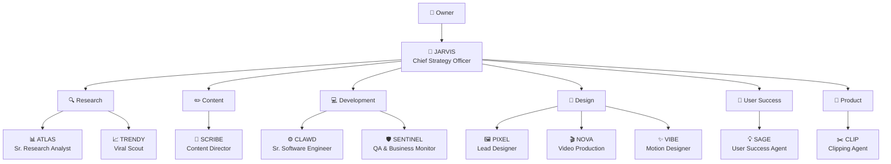

<!-- readme-gen:start:hero -->
<div align="center">


</div>
<!-- readme-gen:end:hero -->

<!-- readme-gen:start:badges -->
<div align="center">


</div>
<!-- readme-gen:end:badges -->

<!-- readme-gen:start:tech-stack -->
<p align="center">
  
</p>
<!-- readme-gen:end:tech-stack -->

<!-- readme-gen:start:social -->
<div align="center">


</div>
<!-- readme-gen:end:social -->


> **Your entire AI workforce, defined in one repo.** VelvetClaw is a declarative blueprint for multi-agent OpenClaw organizations. Fresh install, select a model, point at this repo — and your 11-agent team self-assembles with skills, memory, workflows, and a live dashboard.


## Highlights

<table>
<tr>
<td width="50%" valign="top">

### 🧬 Org-as-Code
Define your entire agent hierarchy — roles, skills, triggers, memory — in YAML. Version it. Fork it. Share it.

</td>
<td width="50%" valign="top">

### 🚀 One-Command Bootstrap
`clawhub install org-bootstrap` → point at any manifest repo → agents self-assemble with skills, memory, and workflows.

</td>
</tr>
<tr>
<td width="50%" valign="top">

### 🧠 Shared Memory
ClawVault primitives (tasks, projects, decisions, lessons) as markdown + YAML. The filesystem IS the message bus between agents.

</td>
<td width="50%" valign="top">

### 📊 Mission Control
Live dashboard with Activity Feed, Calendar, Global Search, Org Chart, and Usage Tracker. Know what every agent is doing.

</td>
</tr>
<tr>
<td width="50%" valign="top">

### ⚡ Trigger-Based Workflows
Content pipelines, research loops, QA monitoring — defined as YAML, executed autonomously across departments.

</td>
<td width="50%" valign="top">

### 🏢 Department Coordination
Escalation chains, shared vaults, cross-department routing, and task handoffs — all declarative.

</td>
</tr>
</table>

## Quick Start

```bash
# 1. Install OpenClaw (if not already installed)
# See https://openclaw.ai

# 2. Install the bootstrap skill from ClawHub
clawhub install org-bootstrap

# 3. Tell your agent to bootstrap from this repo
# "Bootstrap my organization from https://github.com/Sheshiyer/velvetclaw"
```

Your agent will: clone the repo → parse the manifest → create 11 agent workspaces → install skills → seed memory → wire workflows → validate everything.


<!-- readme-gen:start:architecture -->
## Architecture


<!-- readme-gen:end:architecture -->

## The Organization

| Department | Lead | Members | Capabilities |
|:-----------|:-----|:--------|:-------------|
| **Strategy** | 🎯 JARVIS | — | Strategic Planning, Task Orchestration |
| **Research** | 📊 ATLAS | 📈 TRENDY | Deep Research, Web Search, Trend Detection |
| **Content** | 📝 SCRIBE | — | Content Creation, Voice Analysis |
| **Development** | ⚙️ CLAWD | 🛡️ SENTINEL | Full-Stack Dev, QA, Uptime Monitoring |
| **Design** | 🖼️ PIXEL | 🎬 NOVA, ✨ VIBE | Design Concepts, Video Production, Motion Graphics |
| **User Success** | 💡 SAGE | — | User Segmentation, Personalized Emails |
| **Product** | ✂️ CLIP | — | Video Clipping, Caption Generation |

## Workflows

Three built-in automation pipelines that orchestrate agents across departments:

**Content Pipeline** — `workflows/content-pipeline.yaml`
> ATLAS researches → SCRIBE writes → PIXEL designs visuals → SENTINEL reviews

**Research Loop** — `workflows/research-loop.yaml`
> TRENDY scans trends → ATLAS deep-dives → JARVIS creates action items

**QA Monitoring** — `workflows/qa-monitoring.yaml`
> SENTINEL monitors → detects issues → CLAWD fixes → SENTINEL verifies


<!-- readme-gen:start:tree -->
## Project Structure

```
📦 velvetclaw
├── 📄 manifest.yaml              # Org hierarchy — the master blueprint
├── 📄 .env.example                # Environment config template
├── 📂 agents/                     # 11 agent definitions (12 files each)
│   ├── 📂 jarvis/                 # Chief Strategy Officer
│   ├── 📂 atlas/                  # Senior Research Analyst
│   ├── 📂 trendy/                 # Viral Scout
│   ├── 📂 scribe/                 # Content Director
│   ├── 📂 clawd/                  # Senior Software Engineer
│   ├── 📂 sentinel/               # QA & Business Monitor
│   ├── 📂 pixel/                  # Lead Designer
│   ├── 📂 nova/                   # Video Production Lead
│   ├── 📂 vibe/                   # Senior Motion Designer
│   ├── 📂 sage/                   # User Success Agent
│   └── 📂 clip/                   # Clipping Agent
├── 📂 scripts/                    # Operational scripts (17 total)
│   ├── 📄 loop-runner.sh          # Orchestrator daemon (tier-based scheduling)
│   ├── 📄 agent-prompt-assembler.sh  # Reads agent files → claude -p prompt
│   ├── 📄 agent-output-parser.sh  # Parses claude response → structured JSON
│   ├── 📄 write-back.sh           # Applies updates to agent state files
│   ├── 📄 heartbeat-writer.sh     # Structured HEARTBEAT + cycles.jsonl
│   ├── 📄 dispatch-task.sh        # Create task → route by tag → INBOX
│   ├── 📄 task-registry.sh        # Global task state CRUD
│   ├── 📄 vault-write.sh          # Deliverables to vault/ with metadata
│   ├── 📄 agent-status.sh         # ASCII status table for all agents
│   ├── 📄 jarvis-prompt-extras.sh # JARVIS org-wide context builder
│   ├── 📄 escalation-handler.sh   # 3x blocked → escalate to reports_to
│   ├── 📄 idle-detector.sh        # 5 idle cycles → notify JARVIS
│   ├── 📄 babysitter.sh           # Auto-restart loop-runner (max 3)
│   ├── 📄 cost-tracker.sh         # Token usage → CSV + budget alerts
│   ├── 📄 memory-archive.sh       # Monthly HEARTBEAT rotation
│   ├── 📄 notify.sh               # macOS Notification Center alerts
│   └── 📄 health-check.sh         # 7-point agent validation + auto-fix
├── 📂 tests/                      # Bats test suites
│   ├── 📄 loop-runner.bats        # Loop runner tests
│   ├── 📄 prompt-assembler.bats   # Prompt assembly tests
│   ├── 📄 write-back.bats         # Write-back tests
│   └── 📄 integration-dispatch.bats # End-to-end dispatch tests
├── 📂 .velvetclaw/                # Runtime state
│   └── 📄 task-registry.json      # Global task registry
├── 📂 vault/                      # Shared deliverables
│   ├── 📂 research/               # Research outputs
│   ├── 📂 content/                # Content deliverables
│   ├── 📂 design/                 # Design assets
│   ├── 📂 development/            # Code artifacts
│   ├── 📂 handoffs/               # Cross-department routing
│   └── 📂 plans/                  # Task plans and roadmaps
├── 📂 logs/                       # Runtime logs (gitignored)
│   ├── 📄 loop-runner.log         # Daemon output
│   └── 📄 cycles.jsonl            # Structured cycle records
├── 📄 skill-requirements.yaml     # ClawHub skills to auto-install
├── 📂 templates/                  # ClawVault primitive schemas
├── 📂 workflows/                  # Trigger-based automation
├── 📂 departments/                # Department coordination rules
├── 📂 memory/                     # Shared organizational memory
└── 📂 bootstrap-skill/            # The org-bootstrap ClawHub skill
```
<!-- readme-gen:end:tree -->

## Each Agent Gets

Every agent directory contains 12 state files:

| File | Purpose |
|:-----|:--------|
| `MANIFEST.yaml` | Role, model, loop config, skills, triggers, delegation rules |
| `IDENTITY.md` | Persona, voice, communication style |
| `SOUL.md` | Core directives — 5-7 non-negotiable principles |
| `MEMORY.md` | Seed memory — initial context and department awareness |
| `TASKS.md` | Active work queue with step status |
| `INBOX.md` | Cross-agent task assignments (pending/processed) |
| `HEARTBEAT.md` | Structured cycle log (outcome, duration, tokens) |
| `CONTEXT.md` | Known pitfalls, error patterns, learned constraints |
| `TOOLS.md` | Available tool definitions |
| `USER.md` | User-facing configuration |
| `AGENTS.md` | Known peers and delegation targets |

## Customization

Fork this repo and modify to match your organization:

| What to Change | Where |
|:---------------|:------|
| Add/remove departments | `manifest.yaml` |
| Add/remove agents | `agents/` + update `manifest.yaml` |
| Change agent skills | `skill-requirements.yaml` + agent `MANIFEST.yaml` |
| Customize task schemas | `templates/` |
| Define new workflows | `workflows/` |
| Adjust coordination | `departments/` |

The `org-bootstrap` skill works with **any** repo following this manifest structure — not just VelvetClaw.


<!-- readme-gen:start:health -->
## Project Health

| Category | Status | Score |
|:---------|:------:|------:|
| Structure | ████████████████████ | 100% |
| Agent Definitions | ████████████████████ | 100% |
| Workflows | ████████████████████ | 100% |
| Documentation | ████████████████████ | 100% |
| Operational Scripts | ████████████████████ | 100% |
| Tests | ████████████████░░░░ | 80% |
| CI/CD | ░░░░░░░░░░░░░░░░░░░░ | 0% |

> **Overall: 83%** — Fully operational local swarm, needs CI pipeline
<!-- readme-gen:end:health -->

---

## Quick Start: Running the Agent Swarm

### Prerequisites

- macOS with Bash 4+ (`brew install bash` if needed)
- `claude` CLI installed and in PATH
- `jq` installed (`brew install jq`)
- `bats-core` for tests (`brew install bats-core`)

### Setup

1. **Configure environment:**
   ```bash
   cp .env.example .env
   # Edit .env — at minimum set ANTHROPIC_API_KEY
   ```

2. **Validate agent health:**
   ```bash
   ./scripts/health-check.sh
   # Should show 11/11 healthy
   ```

3. **Start the agent swarm:**
   ```bash
   # Start the babysitter (which manages the loop runner)
   ./scripts/babysitter.sh start

   # Or run loop-runner directly (foreground, for debugging)
   ./scripts/loop-runner.sh run
   ```

4. **Dispatch work:**
   ```bash
   # Create and route a task
   ./scripts/dispatch-task.sh "Research competitor pricing" --tag research --priority high
   ./scripts/dispatch-task.sh "Fix login page CSS" --tag code
   ./scripts/dispatch-task.sh "Create social media banner" --tag design
   ```

5. **Monitor:**
   ```bash
   # Agent status overview
   ./scripts/agent-status.sh

   # Cost tracking
   ./scripts/cost-tracker.sh report

   # View logs
   tail -f logs/loop-runner.log
   tail -f logs/cycles.jsonl | jq .
   ```

### Architecture

```
+---------------------------------------------+
|              babysitter.sh                   |
|         (monitors + auto-restarts)           |
+----------------------+-----------------------+
                       |
+----------------------v-----------------------+
|             loop-runner.sh                   |
|    (scheduler -- triggers agents on cron)    |
+----------------------+-----------------------+
                       | for each agent on schedule
+----------------------v-----------------------+
|         agent-prompt-assembler.sh            |
|  (reads IDENTITY + TASKS + INBOX + CONTEXT)  |
+----------------------+-----------------------+
                       | prompt
+----------------------v-----------------------+
|              claude -p                       |
|      (executes one cycle step)               |
+----------------------+-----------------------+
                       | raw output
+----------------------v-----------------------+
|         agent-output-parser.sh               |
|     (extracts structured file updates)       |
+----------------------+-----------------------+
                       | parsed JSON
+----------------------v-----------------------+
|             write-back.sh                    |
|  (applies updates to TASKS, HEARTBEAT, etc.) |
+----------------------+-----------------------+
                       |
+----------------------v-----------------------+
|          heartbeat-writer.sh                 |
|    (structured logs + cycles.jsonl)          |
+----------------------------------------------+
```

### Key Commands

| Command | Description |
|---------|-------------|
| `./scripts/loop-runner.sh start` | Start agent loop daemon |
| `./scripts/loop-runner.sh stop` | Stop agent loop |
| `./scripts/loop-runner.sh status` | Check loop runner status |
| `./scripts/babysitter.sh start` | Start auto-restart monitor |
| `./scripts/dispatch-task.sh "task" --tag TAG` | Create and route a task |
| `./scripts/task-registry.sh list` | View all tasks |
| `./scripts/agent-status.sh` | Agent health overview |
| `./scripts/cost-tracker.sh report` | View token costs |
| `./scripts/health-check.sh` | Validate agent files |
| `./scripts/memory-archive.sh` | Archive old HEARTBEAT entries |
| `bats tests/` | Run test suite |

### Configuration

All config in `.env`:

| Variable | Default | Description |
|----------|---------|-------------|
| `ANTHROPIC_API_KEY` | (required) | API key for claude -p |
| `CLAUDE_MODEL` | claude-sonnet-4-20250514 | Default model |
| `LOOP_MAX_CONCURRENT` | 2 | Max parallel agents |
| `LOOP_WORKING_HOURS_ONLY` | false | Restrict to work hours |
| `MAX_RESPAWNS` | 3 | Babysitter restart limit |
| `COST_ALERT_THRESHOLD` | 10.00 | Daily cost limit (USD) |

### Troubleshooting

**Agents not starting:**
- Check `./scripts/health-check.sh` -- fix any issues
- Verify ANTHROPIC_API_KEY is set in .env
- Check `logs/loop-runner.log` for errors

**High costs:**
- `./scripts/cost-tracker.sh report` -- identify expensive agents
- Lower LOOP_MAX_CONCURRENT to reduce parallelism
- Set COST_ALERT_THRESHOLD lower for earlier warnings

**Agent stuck/blocked:**
- Check `agents/{name}/CONTEXT.md` -- Known Pitfalls section
- Check `agents/{name}/HEARTBEAT.md` -- recent cycle outcomes
- Clear the lock: `rmdir /tmp/velvetclaw-lock-{agent_id}`

---

## Contributing

We welcome contributions! Please see our [Contributing Guide](CONTRIBUTING.md) for details.

## License

[MIT](LICENSE)

<!-- readme-gen:start:footer -->
<div align="center">


**Built with ❤️ by [Contributors](https://github.com/Sheshiyer/velvetclaw/graphs/contributors)**

</div>
<!-- readme-gen:end:footer -->
